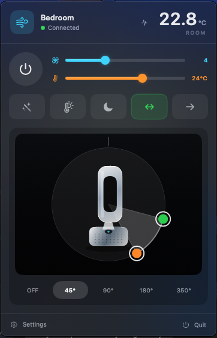

# Dyson macOS Controller

Unofficial native macOS menu-bar controller for compatible Dyson air-treatment devices.

> This is an independent community project. It is not affiliated with, endorsed by, or sponsored by Dyson Ltd. Do not use Dyson logos or copyrighted assets with this project.

## Status

The initial tested target is the Dyson Purifier Hot+Cool Formaldehyde HP09 (`527K`). The repository contains a functioning fixture-tested MVP core, a native `MenuBarExtra` shell, local MQTT transport, Bonjour discovery, Keychain storage, and MyDyson email/OTP provisioning. Live device verification still requires a physical compatible device and the user's own MyDyson account/OTP.

## Screenshot



The screenshot shows the intended menu-bar control surface. Values and connection state depend on the connected device.

## Supported functionality

- Power and fan speed 1–10.
- Auto mode, heating, target temperature, oscillation, custom oscillation angles, airflow direction, and night mode.
- Room temperature, humidity, PM2.5, PM10, VOC index, and NO₂ index when reported by the device.
- Local MQTT state subscriptions with a single connection per active device.
- Bonjour discovery with hostname/IP manual fallback.
- Optional MyDyson email/password/OTP provisioning.
- Keychain-only credential storage and redacted diagnostic logging.

Controls are capability-gated so additional compatible models can be added without hardcoding the UI to HP09.

## Privacy model

There is no telemetry or analytics. Cloud services are used only by the optional initial provisioning flow. Normal control stays on the local LAN. Passwords, access tokens, and MQTT credentials are not stored in plaintext or written to logs.

## Installation and first connection

This is currently a source build for local development. There is not yet a notarized download or a Homebrew package.

### Requirements

- macOS 13 or newer.
- Xcode 15 or newer, including Swift Package Manager.
- A Wi-Fi-enabled, compatible Dyson device already configured in the official MyDyson app.
- Your Mac and Dyson device on the same local network for normal control.

### Build the app

Clone the repository, run the fixture tests, build the app bundle, and launch it:

```bash
git clone https://github.com/minhazk/dyson-macos-controller.git
cd dyson-macos-controller
swift test
./scripts/build-app.sh
open build/DysonMenuBar.app
```

The build script creates an ad-hoc signed app bundle for local development. If macOS shows a security prompt, open the app from Finder and confirm that you built it from this repository. Release signing and notarization are not included yet.

### Provision through MyDyson

This is the easiest setup path for most users:

1. Open the Dyson wind/temperature item in the macOS menu bar.
2. Choose **Settings**.
3. Open the **Account** tab and select the country used when your MyDyson account was created.
4. Enter your MyDyson email and choose **Send verification code**.
5. Enter your MyDyson password and the newest email OTP, then choose **Complete login and provision**.
6. The app obtains the device's local MQTT credentials, stores the provisioning data in Keychain, and attempts Bonjour discovery.
7. Return to the menu-bar popover when the device is connected.

Your password and OTP are used for the login request and cleared from the form afterwards. The optional cloud flow is only used to obtain local device credentials; normal device control stays on the local network.

If Bonjour cannot find the device, open **Settings → Devices**, enter the device hostname or IP address, and choose **Save host and reconnect**. A fixed DHCP lease is recommended if your router frequently changes the device's address.

### Manual local MQTT setup

Use this path only if you already have the device's local MQTT details. In **Settings → Devices**, enter the serial number, device model/type, MQTT port, username, password, and root topic. The host is optional when Bonjour discovery is available. Choose **Save securely and connect**; the credentials are stored in Keychain rather than plaintext configuration files.

Do not post MQTT credentials, access tokens, serial numbers, or diagnostic payloads publicly.

### What to expect

- The currently tested device is the HP09 / `527K`.
- Other Wi-Fi-enabled models may work when their manifest capabilities match, but they are not all live-tested yet.
- Controls are capability-gated, so unsupported heating, oscillation, or sensor features are hidden or disabled.
- The app currently manages one active device at a time.
- A live device is not available in CI; automated tests use synthetic MQTT fixtures.

## Known limitations

- Dyson's private API may change; provisioning errors should be handled through the manual setup flow.
- A live Dyson device is not available in CI, so CI uses only synthetic MQTT fixtures.
- Heating and custom oscillation controls are hidden or disabled when the manifest does not advertise the required capability.
- The app currently focuses on one active device in the menu bar; the settings model is ready for multiple stored devices.

## Acknowledgements

Protocol behavior is informed by the community work in [opendyson](https://github.com/libdyson-wg/opendyson), [libdyson-neon](https://github.com/libdyson-wg/libdyson-neon), [appapi](https://github.com/libdyson-wg/appapi), and [ha-dyson](https://github.com/libdyson-wg/ha-dyson). The local transport implements the Dyson-compatible MQTT 3.1 wire protocol directly.
